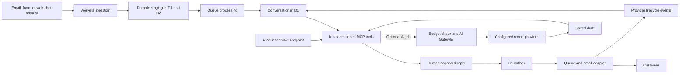

**Typenow product strategy and research**

Research date: 1 October 2026. Prepared for Karn, founder of Typenow and Karnstack.

This document recommends a product direction for typenow.sh, explains the evidence behind it, and defines what to validate before investing in a broad support platform. It combines the earlier research with another pass through direct competitors and current Cloudflare documentation. Prices are in USD unless stated otherwise.

The recommendation is to build an open source customer inbox for small software businesses. Email, forms, and an embeddable web chat start conversations in the same inbox. Customer context helps the founder answer them. Customers can use Typenow through its interface or their own AI client. Cloudflare is the deployment target for both the managed service and the self-hosted edition.

The moat to pursue is distribution through developers: become the inbox they install with their products and recommend to other founders. This is an ambition to earn through adoption, integrations, and trust. There is no undisputed feature moat in the research.

**The decision and its limits**

Build one daily-use inbox first. Keep the form builder focused on support requests and business inquiries. Sell the hosted service for convenience and dependable operation, with a free entry plan and an inexpensive workspace subscription.

Karnstack is the first customer. Its two initial workflows are learner support and business inquiries, handled in one inbox. The founder has explicitly chosen both. Karnstack's public website sells engineering courses and directs customer questions to email, which gives the pilot a real starting point. Actual conversation volume, recurring issues, and response time are still unknown. [Karnstack](https://karnstack.com/)

This is a research-backed recommendation, not proof of demand. The market is crowded, including competitors targeting small teams. Proceed with a narrow pilot and external validation. Do not spend months matching Zendesk before finding customers who prefer Typenow.

**How the research was conducted**

Primary product pages, pricing pages, documentation, and public repositories were inspected using the Reins CLI in the browser. Search helped discover additional competitors; their own sites and repositories were used to assess claims. The work did not create competitor accounts, test deliverability, benchmark deployments, interview customers, or establish production quality.

Links support the associated facts. Competitive implications, proposed architecture, pricing, and success criteria are our judgments or hypotheses. Published feature claims are evidence that a vendor advertises a capability, not evidence of its reliability. Dynamic pricing and beta services need checking again before public launch.

**What the market already provides**

| Product | Verified capabilities and commercial model | Implication for Typenow |
| --- | --- | --- |
| Tally | Free forms and submissions under fair use, including logic, uploads, payments, integrations, and webhooks. Monthly Pro is $29 and Business is $89. It has an MCP server. [Pricing](https://tally.so/pricing), [MCP](https://developers.tally.so/api-reference/mcp) | A cheaper general form builder has a difficult free competitor. MCP does not create a unique category. |
| OpnForm | An open source form product with MCP for creating and managing forms. [MCP](https://opnform.com/mcp) | Open source forms plus AI-client access already exist. |
| Formbricks | Its 5.1 release describes an AI survey builder and MCP server. [Release](https://formbricks.com/blog/formbricks-5-1) | AI-assisted survey creation is also established. |
| SplitForms | A form backend aimed at AI-built sites, with MCP and a $5/month plan advertised. [Product](https://splitforms.com/) | Forms infrastructure for AI-generated apps is already a direct competitive proposition. |
| Fernand | Free shared email, live chat, knowledge base, AI, integrations, unlimited seats, and 100 sent messages/month. Paid is $29 per active human/month. [Pricing](https://getfernand.com/pricing/) | This is the strongest early benchmark for a simple product aimed at small SaaS teams. |
| Plain | API-first support with customer cards and MCP. Foundation lists $35/month for one seat, billed yearly, with extra seats at $35. [Pricing](https://www.plain.com/pricing), [MCP](https://www.plain.com/docs/integrations/mcp-server), [Customer cards](https://www.plain.com/docs/product/platform/customer-cards) | Product context and support from an AI client are already available in a polished developer-oriented product. |
| Crisp and Hugo | Crisp Mini is $45/workspace/month with four seats and shared email. Hugo adds AI support with knowledge sources and MCP integrations. [Pricing](https://crisp.chat/en/pricing/), [Hugo](https://hugo.ai/en/), [MCP](https://help.crisp.chat/en/article/how-to-build-mcp-integrations-with-hugo-tlrqmn/) | Flat workspace pricing and an AI support agent are competitive baselines. |
| Chatwoot | An open source support platform with a free self-hosted Community edition and paid self-hosted plans. [Features](https://www.chatwoot.com/features), [Self-hosted plans](https://www.chatwoot.com/pricing/self-hosted-plans/) | Being an open source helpdesk is insufficient differentiation. |
| FreeScout | A self-hosted PHP shared inbox, with official extensions sold as one-time purchases, including API and webhooks. [Product](https://www.freescout.net/), [Modules](https://www.freescout.net/modules/), [Modules FAQ](https://www.freescout.net/modules-faq/) | Cheap ownership and a community extension model have longstanding competition. |
| Libredesk | Free self-hosting with all features included. Email, live chat, customer attributes, AI, APIs, and permissions. Requires Postgres and Redis alongside its binary. [Product](https://libredesk.io/), [AI documentation](https://support.libredesk.io/en/articles/ai) | A fully free core and configurable AI providers are already available. |
| Cloudflare Agentic Inbox | Apache-licensed self-hosted email client with AI drafts and MCP, built on Cloudflare. [Repository](https://github.com/cloudflare/agentic-inbox) | Cloudflare infrastructure plus AI plus MCP is already demonstrated publicly. |
| HQBase | Free AGPL team email on Cloudflare, with mailbox permissions, multiple domains, MCP, and an upgrade/backup path. [Product](https://hqbase.io/) | Even a polished self-hosted Cloudflare team inbox is an existing proposition. |
| ResolveHQ | Self-hosted Cloudflare helpdesk with shared inbox, threading, notes, assignments, AI assistance, exports, API keys, and read-only MCP. [Repository](https://github.com/mirza-rizvi/ResolveHQ) | This is direct evidence against treating the proposed architecture as a moat. |

The additional pass strengthens the case for a narrow release, but weakens any claim of unique technology. ResolveHQ overlaps substantially with the proposed stack and feature set. Libredesk already documents AI providers, account-lookup tools, human handoff, and knowledge suggestions derived from resolved conversations. Learning from past replies is therefore not a unique proposition. [Libredesk AI](https://support.libredesk.io/en/articles/ai)

Plain also connects to Cursor to answer questions about a product's code from a support thread. Its documentation describes a Cursor Cloud Agents integration requiring a supported Cursor plan. Building code investigation into support could be useful later, but it would not establish a new category. [Plain Cursor integration](https://www.plain.com/docs/integrations/cursor)

**Why the initial Tally alternative changed**

Tally's free product already covers many features companies value: conditional questions, validation, file collection, and integrations. Its fair-use policy allows substantial usage, while explaining when sustained high usage requires a different arrangement. Typenow should not advertise a stronger unlimited promise without understanding its own cost and abuse patterns. [Tally pricing](https://tally.so/pricing), [Tally fair use](https://tally.so/help/fair-use-policy)

For the chosen customer, a form submission is the beginning of work. Someone must identify the customer, investigate, reply, and follow up. A focused inbox can serve that complete workflow. That is the product rationale for retaining forms as a channel instead of making a general-purpose survey builder the main business.

Reconsider a standalone forms direction only if external customers consistently prefer the form editor and do not use the inbox. The current research does not justify building two products in parallel.

**The customer and the promise**

Start with technical founders and teams of roughly one to five people running paid software or developer products. They answer their own customer email and business inquiries, have a product or account system worth connecting, and need a better daily workflow than a personal mailbox. Team size is a targeting hypothesis, not a market statistic.

The initial promise is simple: your customer inbox, connected to your product.

A useful demo should show a request arriving, the right customer context appearing, an answer being drafted, and a reply reaching the customer. Explain self-hosting and MCP after demonstrating that workflow. Most buyers will first care whether Typenow makes answering customers easier.

A credible reason to choose Typenow should combine easy setup, focused interaction design, product context, and an ownership option. A buyer who only wants basic email and included AI may reasonably choose Fernand. Typenow must earn the additional reason to switch.

**The single moat to build**

The moat is developer distribution supported by a trusted integration ecosystem. Aim to become a standard customer-communication component in the products these developers ship.

Make installation and embedding easy enough that developers recommend Typenow. Publish useful integrations with small, documented interfaces. Keep upgrades and exports dependable. Developers who contribute a connector, a deployment guide, or a starter integration can make the product easier for the next customer to adopt.

Karnstack is the private first customer. Build and use Typenow internally before reaching out to other founders; there is no build-in-public commitment. Once the core workflow is reliable, use direct outreach and working demonstrations of real support and inquiry flows. Open source releases and useful integrations can support adoption later, without making public development a requirement.

The difficult asset to reproduce is the accumulated adoption, integration maintenance, and reputation. The underlying features remain copyable. Customer data should remain portable; artificial export restrictions would work against the trust this strategy needs.

Measure this developing advantage through referred activations, integration usage, repeat usage, and contributions that remain maintained. GitHub stars alone do not establish it.

**What to borrow from Dub**

Dub's launch retrospective describes the value of its open source community. Its API announcement documents an investment in developer access, examples, and SDKs. My inference is that product quality and developer distribution reinforce each other; neither a prettier interface nor one clever feature explains the whole business. [Launch retrospective](https://dub.co/blog/product-hunt), [API announcement](https://dub.co/blog/announcing-dub-api)

Plain's headless-support page also shows Dub as an implementation example. That is a useful reminder that the reference product already uses serious support infrastructure. [Plain headless support](https://www.plain.com/solutions/headless-support)

For Typenow, the practical quality standard is a readable conversation view, fast navigation, polished forms, clear delivery feedback, and a deployment guide that works. Delay decorative AI interfaces until the core inbox feels good every day.

**The Karnstack pilot**

| Workflow | Proposed experience | What the pilot must establish |
| --- | --- | --- |
| Course access support | A learner starts a support request. After identity is established, a read-only Karnstack integration shows the relevant course entitlement and account state. Karn reviews and sends a reply. | Whether this saves investigation time and returns accurate, sufficiently current context. |
| Course or account questions | Email joins the same inbox. Topic labels and saved replies help route and answer recurring questions. Optional drafts reference approved material. | Whether the inbox beats the existing mailbox without adding administration. |
| Business inquiry | A short form collects company, contact, request, and optional team size. The conversation is labeled as a business inquiry and can continue over email. | Whether useful details reduce follow-up and whether inquiries need a different workflow. |
| Follow-up | Waiting conversations stay visible; customer replies reopen the work. | Whether requests stop getting lost between replies. |

Do not infer Karnstack's payment provider, entitlement schema, or existing mailbox configuration from its public site. Inspect those during implementation. A typed email address or hidden form field is not authentication. Customer context must come from trusted server-side identity and permissions.

The pilot should improve support operations. It should not quietly become a course tutor, a CRM, or an automated refund engine.

**The first release**

| Area | Required behavior |
| --- | --- |
| Inbox | Email, form, and web chat requests share customers and conversation history. Open, waiting, and resolved states; labels; search; assignment; internal notes; saved replies. |
| Email | Replies, threading, attachments, visible delivery state, bounce handling, and recoverable failures. |
| Forms | A small editor with text, email, select, textarea, and file inputs. Required fields, sensible validation, preview, hosted link, embed, spam controls, and a success state. |
| Web SDK | A framework-independent chat widget with a React wrapper; configurable managed or self-hosted endpoint; visitor sessions, verified-user identity, text messages, reconnect/history, and explicit email follow-up. See [the SDK plan](web-sdk.md). |
| Customer context | A documented read-only connector contract, a generic context panel, and the Karnstack implementation. Distinguish verified identity from a claimed email. |
| API and MCP | Shared permission checks. Read conversations and context, create form drafts, and save reply drafts. Sending is a separate explicit action. |
| Optional AI | Summaries and reply drafts using approved sources. Review before sending. Normal inbox operation survives provider errors or exhausted budgets. |
| Ownership | Export conversations and attachment references, backup guidance, a tested restore procedure, and a documented upgrade path. |
| Hosted operation | Workspace isolation, basic roles, quotas, usage visibility, and operational alerts for failed ingestion or delivery. |

Keep conditional form logic out of the first release unless a pilot form needs it. The October 1 SDK addition brings basic web chat into scope, after the shared inbox and reply path work. Start with text conversations and email continuation. Typing indicators, elaborate presence, proactive campaigns, chatbots, payments, signatures, long surveys, advanced form analytics, WhatsApp, voice, enterprise SLAs, and a visual automation builder remain later candidates. These are scope decisions, not claims that the features lack value.

**AI and MCP have different jobs**

MCP lets a customer's supported Claude, Codex, or other client access Typenow tools. For example, the founder can ask the client to inspect an access-support conversation, consult their code or documentation, and save a reply draft. The client controls its model execution under its own account terms.

Background summaries or automatic drafts generated inside Typenow require inference funded through a model API or Workers AI. A consumer AI subscription must not be assumed to provide unattended API access. Typenow needs separate billing modes for these jobs.

| Mode | Who funds inference | Typenow behavior |
| --- | --- | --- |
| No AI | Nobody | Complete working inbox. |
| Customer AI client through MCP | The customer under the client's supported billing arrangement | Expose permissioned tools; meter hosted tool usage separately if needed. |
| Customer API key | Customer's model-provider account | Explicit provider configuration, bounded jobs, and no silent fallback to Typenow-funded inference. |
| Hosted AI allowance | Typenow, recovered through a metered allowance | Visible usage and budget enforcement; additional usage requires a clear purchase or plan choice. |

For the first release, assistants should create drafts. Add any send tool only with server-enforced authorization and explicit approval tied to the exact recipients and draft version. Reading messages or a model requesting approval must not bypass that check. Approval is a product behavior to implement, not a prompt instruction.

The MCP server should share the application's authorization code, use scoped access, and record mutations in the conversation audit history. Avoid unrestricted tools that expose an entire database or arbitrary private URLs.

Hugo's documentation currently permits choosing supported models but says external provider keys and custom models are unavailable. That is a point of comparison, not a moat: Libredesk already permits configurable providers. [Hugo models](https://help.crisp.chat/en/article/how-to-choose-and-configure-hugos-ai-model-1m4mm57/), [Libredesk AI](https://support.libredesk.io/en/articles/ai)

**The proposed Cloudflare architecture**

Use the same application core in managed and self-hosted deployments. Provider configuration, tenant count, and operational tooling differ. Cloudflare self-hosting means deployment in the customer's Cloudflare account; it does not imply compatibility with a generic VPS or operation independent of Cloudflare.

| Service | Proposed responsibility |
| --- | --- |
| Workers | Serve the interface, API, public forms, widget assets/session API, MCP, and authenticated integration requests. |
| D1 | Workspace, customer, conversation, message, permission, outbox, and usage records. |
| R2 | Raw message content where needed, attachments, and backup artifacts. |
| Queues | Process staged incoming messages and outbound delivery jobs. |
| Durable Objects | Coordinate authorized live chat connections per conversation using hibernatable WebSockets. Persist messages before acknowledgement; fetch history from the durable conversation store on reconnect. |
| Agents SDK | Optional persistent AI sessions or approval coordination. Do not require an AI agent for every normal message. |
| AI Gateway | Observe and route model calls, with rate limits and an additional spending control. |
| Workers AI or external providers | Perform inference when explicitly enabled. |
| Email adapter | Receive and send through the configured provider; normalize provider status and events. |

The proposed message flow keeps persistence separate from delivery and AI work:

An MCP client can also perform its own inference and save a draft directly. The optional AI branch above represents background jobs funded through Typenow or a customer API key.

The Agents SDK provides persistent state and execution capabilities; AI Gateway is the model gateway; Workers AI supplies inference. They do not substitute for each other. [Agents](https://developers.cloudflare.com/agents/), [AI Gateway](https://developers.cloudflare.com/ai-gateway/), [Workers AI](https://developers.cloudflare.com/workers-ai/)

Start with indexed D1 queries, bounded pagination, and straightforward full-text search supported by the chosen schema. Keep tenant routing behind a workspace directory so a busy tenant can move to another database later. D1's paid database size limit is 10 GB, and each database processes queries serially. Do not interpret cheap reads as unlimited capacity. [D1 limits](https://developers.cloudflare.com/d1/platform/limits/)

Incoming content should be staged durably before a job processes it. A reply should create a durable outbox record before attempting delivery. Recover jobs that remain pending when enqueueing or processing fails. Deduplicate inbound events within the correct workspace and inbox; do not merge conversations merely because subjects match.

Represent delivery as separate states for queued, provider accepted, delivered, bounced, failed, and unknown. A successful HTTP request is not proof the customer saw the email. Cloudflare publishes delivery and failure lifecycle events to subscribed queues; its delivered event means the recipient mail server accepted the message. [Email events](https://developers.cloudflare.com/email-service/platform/event-subscriptions/)

Application deduplication cannot guarantee exactly-once sending through an external provider. If a send times out after possible acceptance and provider reconciliation is unavailable, hold it for review rather than blindly sending another copy. Prove this behavior for the chosen email adapter.

Cloudflare controls the outgoing Message-ID, while allowing In-Reply-To and References for threading. Store the returned provider identifiers and test how replies map back to a conversation. An application-generated ID cannot simply replace Cloudflare's Message-ID. [Email headers](https://developers.cloudflare.com/email-service/reference/headers/)

**Email setup is an early technical gate**

Cloudflare Email Sending is currently beta. It supports a Workers binding, REST API, and SMTP. Sending to arbitrary recipients requires Workers Paid; Email Routing handles inbound mail. [Email Service](https://developers.cloudflare.com/email-service/), [REST API](https://developers.cloudflare.com/email-service/api/send-emails/rest-api/)

Its domain onboarding instructions select a domain from the same Cloudflare account. Sending and receiving have separate DNS records. Inbound routing can affect the existing mailbox's MX configuration. [Domain configuration](https://developers.cloudflare.com/email-service/configuration/domains/)

For self-hosting, a customer can configure their own account and domain. For the managed service, arbitrary customer-domain onboarding through Typenow's account remains unproven. Website custom-hostname support does not establish email-domain support. Keep an email-provider adapter and test a conventional verified-sender provider if native Cloudflare onboarding cannot serve the managed model.

Pilot with a dedicated address or subdomain and scoped forwarding where appropriate. Preserve the existing Karnstack mailbox until ingestion and reply routing are proven. Do not require a hosted customer to move their whole domain or primary mailbox to use Typenow.

Current published limits include 5 MiB for outgoing messages with attachments, 25 MiB inbound, and initial daily sending quotas that vary with account standing. Size-check the encoded outgoing message; a nominal 5 MB upload does not necessarily fit. Offer private attachment links for larger files, with an appropriate recipient-access design. [Email limits](https://developers.cloudflare.com/email-service/platform/limits/)

**Security and reliability belong in the core**

These requirements follow from a hosted inbox storing customer conversations. They should be implemented alongside the relevant features, rather than added as an enterprise tier.

- Enforce workspace and inbox permissions on every API, MCP tool, export, attachment download, and background job.
- Resolve customer identity on the server. Prevent a submitted account ID from selecting another customer's private context.
- Sanitize email HTML, control remote content, and treat attachments and quoted messages as untrusted input.
- Keep connector and model credentials out of logs and client responses. Bound connector requests and prevent access to unintended network destinations.
- Treat email text as data during AI execution. It cannot authorize tools or expand permissions.
- Disable sensitive prompt-body logging by default and avoid sharing cached private answers between customers.
- Test backup restoration and tenant isolation. Make failed delivery visible and recoverable.

Cloudflare's Agentic Inbox documents a mailbox access model that permits allowed users to access all mailboxes. It is a reference to inspect, not a drop-in multi-tenant SaaS foundation. [Repository](https://github.com/cloudflare/agentic-inbox)

**The proposed business model**

The self-hosted core should contain the useful product: inbox, forms, API, MCP, integrations, basic permissions, and exports. Earn cloud revenue from managed deployment, backups, upgrades, and operation. A working free installation is part of the developer-distribution strategy.

Choose an actual open source license before publication and document any separate hosting or trademark terms plainly. This research does not settle the license choice. Do not describe a source-available restriction as open source.

| Plan | Proposed starting limits | Reason to choose it |
| --- | --- | --- |
| Self-hosted | Free software; unlimited forms and submissions at the software level; customer pays infrastructure and model usage | Ownership and operation in the customer's account. |
| Hosted Free | One inbox, two users, unlimited forms, 1,000 form submissions/month, 100 outgoing messages/month, 500 MB storage, bounded inbound email processing | Try both email and forms in real work. |
| Hosted Starter | $15/workspace/month; five users, unlimited forms, 10,000 form submissions/month, 1,000 outgoing messages/month, 5 GB storage, custom branding | A small team buys managed operation at a clear price. |
| Hosted AI | Customer key or separately purchased, visible allowance | AI cost stays separate from basic communication. |

Every figure in this table is a pricing hypothesis. The October 1 revision removes form-count caps and makes the submission allowances more generous. Unlimited forms does not imply unlimited hosted processing, file storage, outgoing email, or AI. Meter accepted submissions separately from outbound deliveries and stored attachment bytes. Measure the private Karnstack workload and realistic usage near each proposed cap before treating these allowances as sustainable. Set inbound email quotas and retention before opening public registration. Offer export and communicate quota behavior before a workspace reaches a limit. Count email billing units as outbound recipient deliveries so a message with multiple recipients cannot create unmetered cost; confirm provider counting during the email proof.

Use a small AI trial with a dollar ceiling, not unlimited included inference. Fernand already advertises included AI without per-resolution charges, and Crisp already charges by workspace. Typenow's pricing is intended to fit its economics, not establish novelty. [Fernand](https://getfernand.com/pricing/), [Crisp](https://crisp.chat/en/pricing/)

**The cost model**

Cloudflare currently includes 3,000 outbound emails/account/month on the paid plan, then charges $0.35 per 1,000. Workers Paid starts at $5/account/month. These allowances belong to the account, not to each hosted customer. [Email pricing](https://developers.cloudflare.com/email-service/platform/pricing/), [Workers pricing](https://developers.cloudflare.com/workers/platform/pricing/)

For one self-hosted account sending 10,000 emails/month, email overage is (10,000 minus 3,000) / 1,000 times $0.35 = $2.45. Adding the $5 Workers minimum gives $7.45 before additional compute, storage, AI, and other services. This calculation is not a complete hosting quote.

Illustrative hosted scenario, assuming native Cloudflare email can support the chosen domain arrangement:

| Input or cost | Assumption or calculation |
| --- | --- |
| Paying workspaces | 100 at $15/month, producing $1,500 revenue. |
| Free workspaces | 300; assume each uses its full 100 outgoing messages. |
| Paid outgoing messages | Assume each paid workspace uses its full 1,000 messages. |
| Total monthly outgoing volume | 130,000 provider-counted emails. |
| Email cost | 127,000 above the shared allowance, costing $44.45. |
| Workers minimum | $5; additional usage priced separately. |
| Attachment storage | Assume 650 GB-month total. With 10 GB included and standard storage at $0.015/GB-month, storage alone is $9.60. Operations add cost. [R2 pricing](https://developers.cloudflare.com/r2/pricing/) |
| Visible subtotal | $59.05 for these selected components. This is not total cost or gross margin. |

The model deliberately excludes unmeasured Workers overage, D1 reads/writes, Queues, R2 operations, backups, monitoring, payment fees, alternative email-provider costs, taxes, and human support. Do not use the remaining revenue as a margin claim. Record real per-workspace usage during the pilot. [D1 pricing](https://developers.cloudflare.com/d1/platform/pricing/), [Queues pricing](https://developers.cloudflare.com/queues/platform/pricing/)

AI can overwhelm the selected infrastructure subtotal. As a sensitivity assumption, 10,000 AI-assisted conversations at $0.05 each cost $500, while $0.20 each costs $2,000. Those are hypothetical costs, not measured model quotes. Benchmark complete jobs with retrieval, history, retries, and tool calls before setting an allowance.

AI Gateway's core analytics, caching, and rate limiting are free; model inference is separate. Unified billing adds a 5% fee to purchased credits. Gateway spend limits are eventually consistent and may overshoot during concurrent requests. Use application budget reservations, bounded output and tool steps, and reconciliation against provider bills. [Gateway pricing](https://developers.cloudflare.com/ai-gateway/reference/pricing/), [Unified billing](https://developers.cloudflare.com/ai-gateway/features/unified-billing/), [Spend limits](https://developers.cloudflare.com/ai-gateway/features/spend-limits/)

Protect the free plan through rate limits, storage limits, verified senders, bounce suppression, and limits on new-account sending. Treat it as customer support software, with no bulk-mail campaign feature. Shared account reputation makes abusive sending a cost to every tenant.

**Launch and distribution**

Begin with Karnstack and five to ten external founders with similar workflows. Choose people who currently answer their own email and have enough requests to use the product weekly. A quiet mailbox cannot validate daily usefulness.

Proposed outreach, once a working pilot exists:

> I'm building Typenow, an open source inbox for small software teams. Email and contact forms land together, and you can connect customer account context or use it through your own AI client. I'm running it at Karnstack. I'd like to help you try it with one address and see whether it improves your current workflow.

This is suggested copy, not an instruction to send messages. Avoid promises about response-time improvements until the pilot measures them.

Publish the Karnstack integration, a minimal product starter example, and a Cloudflare deployment walkthrough. Keep examples executable and maintained. Add the next connector based on repeated requests from active users. Do not scatter effort across a long integration list to fill a marketing page.

The managed service should have an easy setup path. The self-hosted edition should have a readiness check that verifies the database, storage, email configuration, and a test round trip. A deployment button that leaves email setup unclear is incomplete onboarding.

**The delivery sequence**

| Stage | Work | Exit condition |
| --- | --- | --- |
| Technical proof | Test owned-domain and hosted-domain email setup, threading, delivery events, uncertain sends, backups, and tenant isolation. | A documented workable provider path for both deployment modes. |
| Karnstack pilot | Implement the inbox, two form templates, a read-only account connector, and normal human replies. Add the basic text-chat SDK once the shared message path works. | Support and business inquiries are handled regularly; the learning-app widget shares the same conversations and supports email follow-up. |
| External pilot | Onboard five to ten founders; observe setup and weekly work. Add minimal MCP and drafts. | Evidence of repeat use, willingness to pay, and manageable support effort. |
| Paid release | Add billing, public quotas, restore tooling, release upgrades, and operational reporting. | Paid users can run the core workflow reliably; costs and recovery are measured. |
| Expansion | Add integrations, knowledge tools, or channels users repeatedly request. | Existing usage and economics justify each expansion. |

This is a dependency sequence, not a calendar estimate. Email and identity behavior deserve proof before visual scope expands.

**Validation and stopping criteria**

The thresholds below are proposed decision rules for the pilot. They are not industry benchmarks.

- At least five external workspaces activate by receiving and replying to real customer messages.
- At least three use Typenow in three separate weeks within a four-week observation period, provided their request volume supports that cadence.
- At least three agree to pay the proposed $15 workspace price after using the product.
- Hosted setup typically reaches a verified email round trip within 15 minutes after prerequisites and DNS are ready. Measure DNS delay separately.
- Record every missing, duplicated, or misthreaded message. Investigate each before broadening the pilot; zero observed failures is not proof of production-scale reliability.
- Track median handling time and the founder's reported effort against their own previous workflow. Do not claim a percentage improvement without a comparable baseline.
- Record infrastructure and AI usage per active workspace, plus founder support time. Establish whether the price can fund operation and support.

If people like the interface but return to their mailbox, investigate the workflow before adding more AI. If buyers consistently say Fernand or Libredesk already solve the need and ownership is unimportant, the recommendation has failed its external test. Narrow the customer group or stop expanding the inbox scope.

If forms retain users while the inbox does not, revisit the product direction using that evidence. Do not preserve this strategy merely because it has been written down.

**Open questions to resolve before implementation commitments**

| Question | How to resolve it |
| --- | --- |
| How many real support and business conversations does Karnstack receive? | Audit a representative period with the founder and record common tasks. |
| How does Karnstack authenticate learners and store entitlements? | Inspect the actual application; specify a minimal read-only integration. |
| What mailbox and domain setup is in use? | Inspect configuration without changing it; plan a reversible pilot path. |
| Can managed customers connect sending domains without moving accounts? | Test native Cloudflare support or select an adapter with verified domain onboarding. |
| How are uncertain sends reconciled? | Test timeout and provider-event behavior with both the binding and fallback adapter. |
| What is the acceptable self-host installation burden? | Observe developers completing a clean deployment without founder intervention. |
| Which license and contribution policy fit the business? | Decide before publishing the repository. |
| What are the actual costs and acceptable plan limits? | Measure the pilot, including support time and AI jobs, then revise pricing. |

The next concrete work is the email and identity proof, followed by a Karnstack inbox that handles both chosen workflows. Typenow should earn its place in real customer communication before claiming to be a new support platform.
