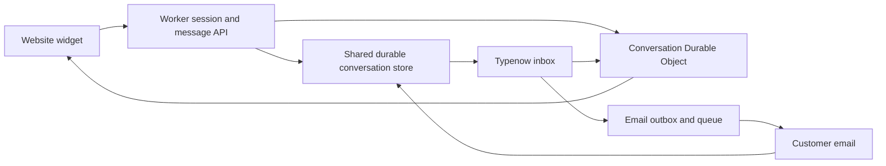

# Typenow web SDK

Design date: October 1, 2026. This is a proposed product and integration contract. The landing page has a local chat demonstration; there is no published SDK or live chat backend yet.

## Product decision

Ship a small embeddable chat widget alongside email and forms. A visitor can ask for help without leaving the product. Their message becomes a normal Typenow conversation with assignment, private notes, customer context, and optional AI drafts. A teammate can answer in the widget while the visitor is there, or continue by email after collecting an address.

For Karnstack, put the widget inside the learning app: course-access questions and bugs arrive beside email support, while business inquiries can still arrive through forms. Reuse one inbox, identity model, permission system, and message history across the three entry points.

The SDK supports the developer-distribution direction by making Typenow easy to install inside products. A chat widget alone is not a defensible moat. The useful advantage would be reliable integrations, straightforward ownership, and adoption developers recommend.

## Initial scope

- Plain JavaScript client, TypeScript declarations, and a thin React wrapper. The SDK must not require React in a plain website.
- A hosted script loader for sites without a build system, plus an npm distribution for applications. Package and CDN names need checking before publication.
- Public workspace configuration, a custom support-button API, and a default floating launcher.
- Text conversations, durable message acceptance, history, reconnect, and visible pending/failed states.
- Guest sessions and a server-issued identity token for signed-in customers.
- Email continuation with an explicit destination, using the same conversation.
- Configurable endpoint so the same client works with Typenow Cloud and self-hosted Cloudflare instances.
- Accessible keyboard operation, mobile layout, and reduced motion.

Defer attachments inside chat, typing indicators, complex presence, campaigns, proactive prompts, and autonomous bots until the basic workflow is reliable. Do not require AI for ordinary chat.

## Proposed client API

The package name and API below are illustrative and not available to install yet.

```ts
import { createTypenow } from '@typenow/web'

const support = createTypenow({
  workspaceId: 'your-public-workspace-id',
  endpoint: 'https://support.example.com',
})

support.open()
support.close()
support.destroy()
```

The workspace ID is a public routing identifier, not an API secret. The endpoint identifies the managed service or customer's installation. Workspace configuration must restrict the domains where the widget is intended to run, while session authorization and rate limits independently protect the backend.

For a signed-in customer:

```ts
// Your application's authenticated backend issues this short-lived token.
const response = await fetch('/api/support-session', { method: 'POST' })
if (!response.ok) throw new Error('Support session unavailable')
const { token } = await response.json()

await support.identify({ token })

// On logout or account changes, remove the previous identity and history.
await support.reset()
```

The backend must derive the customer ID from its authenticated session. It must not sign an arbitrary user ID sent by the browser. Proposed tokens bind the workspace, customer, audience, expiry, and session to a server-held signing credential. Verify them at Typenow before allowing history or customer context access.

A browser-supplied name, email, subscription, or course ID is a claim. It cannot establish account ownership. Fetch trusted product context through the server-side connector.

The React wrapper should handle setup and teardown without creating duplicate launchers during Strict Mode, expose the same methods through context, and render safely during SSR. The base client should only touch the DOM during initialization, not on module import. Exact wrapper component names remain open until the API is implemented.

## Widget behavior

Use a small loader and initialize the conversation UI on first open. Prefer an isolated iframe for the default widget so host CSS does not break it. Validate the source window and exact origin of postMessage traffic in both directions. Document the frame/script/connect origins required by host CSP; self-hosting must not depend on the managed CDN.

Keep the initial surface simple: greeting, current conversation, composer, and a way to provide an email address. Display actual agent availability only when the backend has meaningful evidence. Otherwise say that the visitor can leave a message; never claim someone is online just because the widget loaded.

The interface needs labels, sensible focus placement, Escape dismissal, focus restoration to the launcher, and touch targets. An expanded nonmodal desktop panel should not trap focus. If the mobile implementation becomes a modal sheet, use modal semantics and focus isolation appropriate to that layout.

Handle slow networks and reconnects visibly. Do not show “sent” until the server has accepted the message durably. Keep a stable client message ID for retries so a reconnect does not duplicate a message. Fetch missing history using a server cursor, including after a suspended tab resumes.

Anonymous conversation access should use an opaque scoped session credential. A typed email address must never grant access to previous conversations for that address. When a guest signs in, require a deliberate server-authorized association; do not merge identities just because their display emails match.

## Chat and email continuation

1. The visitor opens the widget and sends a text message.
2. Typenow durably records it in the same model used for email and forms.
3. The teammate sees it in the shared inbox, with its entry channel and verified identity state.
4. While the visitor is connected, the reply can appear in chat.
5. If they leave, the teammate can choose email follow-up after the visitor has supplied an address for replies.
6. Replies to that email return to the same conversation through normal threading.

Start with explicit channel selection for the teammate rather than automatic immediate email duplication. Later notification jobs must deduplicate deliveries and account for messages already seen in the widget. A connection closing is not proof that an email should be sent immediately.

An anonymous chat can remain useful without an email address, but the product must explain that email follow-up requires one. Never imply cross-device recovery without an authenticated identity or an authorized recovery mechanism.

## Cloudflare architecture

Workers handle configuration, visitor sessions, authenticated message APIs, and widget assets. D1 remains the conversation store shared by all channels. R2 remains the attachment store when uploads are added. Queues and the existing email adapter handle requested email continuation.

Use Durable Objects for authorized real-time connections, scoped per conversation rather than concentrating a workspace's entire history in one object. Cloudflare recommends its Hibernation WebSocket API, which can preserve connections while an idle object sleeps. This is an appropriate transport candidate; it does not remove message storage, request, or active-processing costs. [Cloudflare WebSocket guidance](https://developers.cloudflare.com/durable-objects/best-practices/websockets/)



Authorize both visitor and agent connections before joining a conversation. Recheck expiry and access changes; a public workspace ID is insufficient. Scope history reads and writes by workspace and conversation. Avoid leaking private notes or full customer context into visitor broadcasts.

Persist before acknowledging or publishing accepted messages. Use stable event IDs and cursors to reconcile missed or duplicated events; a WebSocket broadcast is not the durable record. Restore connection state after hibernation and never rely on in-memory presence as the sole authorization or history store.

Rate limits should cover session creation, message creation, message size, concurrent sockets, and reconnect attempts. Bound idle lifetime. Add an abuse challenge where warranted. These protections are backend requirements, not secrets hidden in the SDK.

## Pricing and delivery order

Include the basic widget in the open source core and propose it for both cloud tiers. Keep the unlimited-form promise about form count. Chat is additional traffic, not an unlimited-processing promise.

Define and measure inbound/outbound chat-message usage, active sessions, and socket lifetime before publishing chat quotas. Do not silently deduct chat messages from the advertised form submission allowance. Email continuation uses the outgoing email allowance; attachments use storage; optional inference uses a separate AI allowance or customer key.

Build the shared inbox and durable reply path first, then add the text widget for Karnstack's private use. A production SDK release requires checks for two-tenant isolation, guest and verified sessions, logout/reset, retry deduplication, lost connections, chat-to-email threading, failed sends, keyboard operation, mobile layout, SSR, and the deployed Cloudflare runtime.

The current landing demo implements launcher open/close, a welcome screen, an illustrative resumable conversation, suggested questions, topic selection, a local message thread, composer focus, Escape and close-button restoration, and a copyable proposed API. An explicit button adds a canned example team reply. The customer context and initial messages are sample data. State survives closing the widget within the mounted page, but not a reload. The demo sends no message, opens no socket, and does not persist or identify a user.
